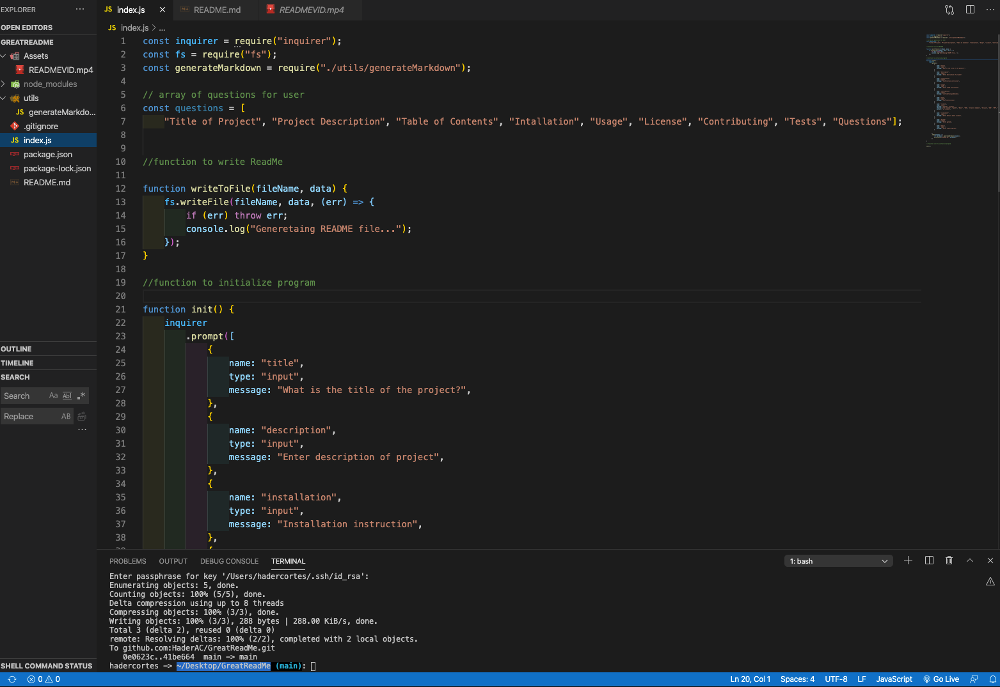

# GreatReadMe Generator

## Table of Contents
- [GreatReadMe Generator](#greatreadme-generator)
  - [Table of Contents](#table-of-contents)
  - [Description](#description)
  - [Installation Instructions](#installation-instructions)
  - [Usage](#usage)
  - [Contribution Guidelines](#contribution-guidelines)
  - [Test Instructions](#test-instructions)
- [License Information](#license-information)
  - [No license](#no-license)
  - [Questions](#questions)

## Description
:spiral_notepad:

* This is an app that runs with node. The app will prompt you to answers the quations necessary to fill out the read me file. It uses the inquirer package.

## Installation Instructions

:keyboard:
:package:
* To install run node index.js

## Usage
:battery:

* No instructions provided

## Contribution Guidelines
:link:

* inquiere package

## Test Instructions
:open_book:

* Run node index.js

# License Information
:memo:
:pencil:

## No license

* No license

## Questions
:e-mail:

If you have further questions you can contact Hadercortes@yahoo.com.

Github: HaderAC@github.com

